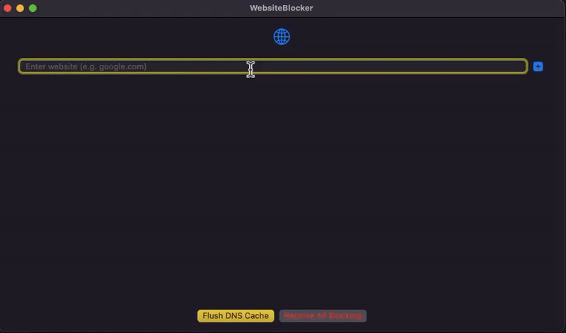

# **WebsiteBlocker**  

I have created a website blocker for macOS as part of my internship 
application to FocusMode. Here is my proposed solution:  

## Approach: Editing the `/etc/hosts` file on macOS and rerouting blocked URLs to localhost

### 1. A SwiftUI app (WebsiteBlocker) that lets you add website URLs 
that you need to block**  
It has a simple UI with the following components:  
- A **textfield** to enter the URL and a button to add the URL to your 
blocklist  
- A **blocklist** that displays the list of all URLs entered by you and 
buttons to:  
  - Toggle the URLs on and off  
  - Delete the URLs from your blocklist  
- **Buttons to flush `dscache`, run `killall mDNSResponder`, and remove 
all entries**  

### 2. A CLI Helper executable (WebsiteBlockerHelper)**  
- Runs terminal commands for the app to create, update, and delete entries 
in `/etc/hosts`.  
- The mac app writes the blocked URL entries to a json file at 
`~/blocklist.json`, and the CLI helper reads from this file to add or 
remove entries from the `/etc/hosts` file.  


## **Why did I choose this approach?**  

There are multiple ways to create a WebsiteBlocker on macOS, and I have 
listed all the approaches that I explored further below.  

I chose editing the `/etc/hosts` file as my preferred method since it 
seemed to be less complex than my alternatives like using 
**NetworkExtensions, SMJobBless, and XPC** to make my app run.  

And I was of the impression that I will need an **Apple Developer Account 
for code signing** to make the Network Extension method work. Hence, given 
the time constraint and scope of this assignment, I decided to make an app 
that **modifies the `/etc/hosts` file** on macOS to block websites.  


## **Challenges associated with my approach:**  

### 1. You need admin privileges to write to the `/etc/hosts` file with 
the CLI Helper**  
- While that works pretty well if you’re manually doing it from the 
terminal, it’s not easy to make your app run the scripts automatically.  
- You need to use **osascript** (proved unreliable for me) or bundle the 
CLI helper using **SMJobBless** and interact with the system through 
**XPC**.  

### 2. Even after writing to `/etc/hosts`, a system-wide block for the 
given websites isn’t guaranteed**  
- My CLI helper did the job pretty well on the terminal, but on Safari, 
websites like **Facebook, Instagram, and LinkedIn bypassed the block** if 
they were using DNS services like Cloudflare.  
- Also, your `/etc/hosts` file needs to have permission **644** instead of 
**600**, which I had to manually change.  

Making all these changes through the app wasn’t convenient.  

### **3. My initial idea for first-time setup didn’t work**  
- My initial idea was to have the app prompt the user to run a command 
using `sudo` on the first run of the app, after which the user would never 
have to bother with this.  
- However, I was unable to implement this.  


## **Current Status**  

### ✅ **What Works:**  
- The **UI of the app** lets you add URLs to the blocklist, and you can 
toggle the blocking on/off and delete entries from the blocklist.  
- The **CLI helper** adds the IPv4 and IPv6 addresses of the websites you 
wish to block by reading from the `~/blocklist.json` file.  
- If you build the CLI tool, write your entries to the json file, and run 
the tool with the `--update` flag, you will observe a **system-wide 
block** for the websites you blocked.  
- **Pinging the sites through the terminal** will resolve them to 
`127.0.0.1`.  

### ❌ **What Doesn't Work Yet:**  
- The **Mac app does not modify `/etc/hosts` in the background** (it does 
not write to `blocklist.json` or `/etc/hosts`).  
- On Safari, **some sites still load (e.g., Facebook, Instagram, 
LinkedIn)** due to alternative DNS services or cache resolution.  


## **Demo**  

Here’s a GIF showcasing the UI of the WebsiteBlocker app in action:  

  


## **Building and Running the CLI Tool**

### Prerequisites
- Xcode 14.0 or later
- macOS 12.0 or later

### Steps to Build and Run:

1. **Build the CLI Tool:**
   ```bash
   cd WebsiteBlockerHelper
   swift build
   ```

2. **Create a blocklist.json file in your home directory:**
   ```bash
   echo '{"sites": ["facebook.com", "instagram.com"]}' > ~/blocklist.json
   ```

3. **Run the CLI Helper:**
   ```bash
   sudo .build/debug/WebsiteBlockerHelper --update
   ```

Note: The tool requires sudo privileges since it modifies the `/etc/hosts` file.

### Available Commands:
- `--update`: Updates the hosts file with blocked sites
- `--remove`: Removes all blocked sites from hosts file
- `--list`: Shows currently blocked sites


## **Other approaches that I explored:**  

### **1. Using Network Extensions**  
- A much more robust method using Apple’s `NetworkExtensions.framework` 
which allows a **Content Filter or DNS Proxy** to intercept and block 
network traffic.  
- However, it **requires an Apple Developer Account** for code signing, 
which I currently do not have.  

### **2. Firewall rules (`pf.conf`)**  
- We can use `pf.conf` to block traffic based on domain names.  
- **Requires admin privileges and modifying system configurations.**  

### **3. XPC + SMJobBless**  
- XPC would’ve allowed my sandboxed app and CLI helper to communicate.  
- SMJobBless would’ve allowed me to **install my privileged CLI helper**.  
- This process **requires code signing with an Apple Developer ID** and 
hence, is infeasible for me.  
- Also, setting up **XPC is complicated**, so I did not attempt it given 
the time constraints.  

### **4. Browser Extensions**  
- Works but **didn’t feel like the best answer** since the assignment asks 
for a **Mac app**.  

### **5. Proxy settings**  
- Seemed like **something that will fail frequently** and will have to be 
set up again and again.  


## **Additional Background:**  

I am submitting this assignment about **4 hours later than the 4-day 
deadline** (The time is **4:20 AM on 18/2**, received assignment at 
**10:00 AM on 14/2**).  

While trying to make this app work, I **tinkered around with the 
`/etc/hosts` file and changed my DNS settings** to get the CLI tool to 
work. Somewhere along all of that, **I messed up my DNS.**  

As a result:  
- I **could not push my code to the remote repo**.  
- I **could not ping a lot of sites even through the terminal**.  
- **Random sites stopped working** and `git` couldn’t even resolve the 
host `github.com`.  

After multiple rounds of **restarting my Mac, my other Windows laptop, and 
even my phone’s hotspot**, I could get the internet to work to complete 
this submission.  


## **Lesson Learnt:**  
1. **Don’t do just about anything that LLMs suggest you to debug 
problems.🫠**  
2. **Networking issues can be a nightmare to debug.**  
3. **Always leave extra buffer time when working with system-level 
configurations.**  


## **Final Note:**  

However, I promise that **I’ll be just as dedicated in zapping bugs and 
figuring out problems** should you decide to hire me as an intern.  

This problem statement was amazing, and I learned **a lot** trying to 
figure this out.  

I’ll be really fortunate if I land this internship as I believe I’ll get 
to **learn a lot under experienced iOS Devs**.  


## **TL;DR**  
✅ **CLI tool works** (blocks websites via `/etc/hosts`).  
❌ **Mac app UI is functional but doesn’t modify `/etc/hosts` yet.**  
🔜 **Future improvements:** Fix UI-CLI integration & handle DNS-based 
bypassing.
